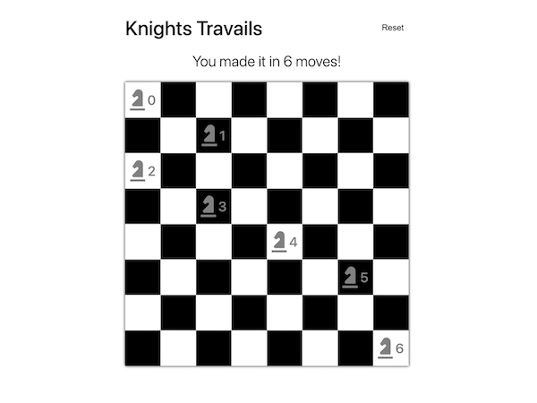

# Knights Travails

Knights Travails is an app intended to calculate and display the minimum number of moves and route a chess piece would need to get from a start point to an end point on a chess board. This app uses a custom graph like data structure and breadth first search to calculate the knight's moves. Creating this project allowed me to become comfortable using data structures, which I hope to utilize further in my future projects.

    <a href="https://nicholaspreziosi.github.io/knights-travails/">
        
        </img>
    </a>

## Technologies Used

    <li style="margin: auto">
        
        HTML
    </li>
    <li>
        
        CSS
    </li>
    <li>
        
        JavaScript
    </li>
    <li>
        
        Webpack
    </li>

## Live Demo

View a live demo [here](https://nicholaspreziosi.github.io/knights-travails/).
